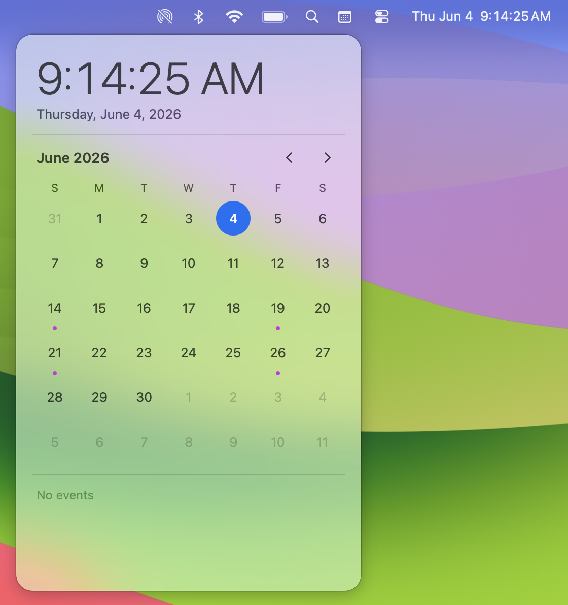

# QuickCal

**A tiny macOS menu bar calendar**

Expands to a full month calendar with your agenda. Native calendar opens your events with one click away.



## What it does

- **Click** the menu bar icon → a smooth calendar flyout appears
- **Month grid** with today highlighted and event dots on days with events
- **Zoom out** by clicking the month/year header: Month → Decade → back
- **Agenda strip** shows today's events pulled from your Apple Calendar
- **Live clock** configurable to replace system clock, allowing clicking time to open calendar.

## Modes

macOS doesn't let third-party apps hide the system clock, so QuickCal offers two ways to fit into your menu bar:

### Calendar Icon *(default)*

A small `calendar` SF Symbol sits in your menu bar. Your system clock stays exactly as you have it. Clean, minimal, zero interference. Best if you just want the flyout without changing anything.

### Analog Companion

QuickCal can be configured to replace the system clock with its own **fully configurable digital readout** — 12/24h, seconds, day of week, date, flashing separators. You set the system clock style to **Analog** (a tiny clock face), which naturally takes up less space and recedes visually. QuickCal becomes your primary time display, and clicking it opens the flyout.

> To enable Analog Companion: right-click the QuickCal clock → **Clock Style → Analog Companion**, then open **System Settings → Control Center → Clock Options** and set Style to Analog.

The onboarding flow walks you through this automatically on first launch.

## Requirements

- macOS 26 (Tahoe) or later
- Apple Silicon or Intel
- Xcode 26+ (to build from source)
- [xcodegen](https://github.com/yonaskolb/XcodeGen): `brew install xcodegen`

## Install

### Download

1. Download the latest `QuickCal-<version>-apple-silicon.dmg` from [Releases](https://github.com/binbuf/QuickCal/releases).
2. Open the DMG and drag **QuickCal** into **Applications**.

**First open — clearing the "damaged" warning.** QuickCal is ad-hoc signed but not
yet notarized by Apple, so the first time you open a downloaded copy macOS may say
*"QuickCal is damaged and can't be opened."* The app is fine — this is just
Gatekeeper blocking an un-notarized download. Clear it once and it never returns:

```bash
xattr -dr com.apple.quarantine /Applications/QuickCal.app
```

Then double-click QuickCal as usual.

> You can also try **System Settings → Privacy & Security**, scroll to the Security
> section, and click **Open Anyway** if it's offered. Note that for the *"damaged"*
> message macOS often doesn't show that button (it's meant for the milder
> "unidentified developer" prompt), so the Terminal command above is the reliable
> fix. Right-click → Open no longer bypasses this on recent macOS.

### From source

```bash
git clone https://github.com/binbuf/QuickCal
cd QuickCal
make run        # generate project, build debug, launch
```

Or step by step:

```bash
make generate   # create .xcodeproj from project.yml
make build      # debug build
make release    # release build → ./build/Build/Products/Release/QuickCal.app
```

> If `xcode-select -p` points to CommandLineTools instead of Xcode.app, the Makefile handles this automatically. To fix it globally: `sudo xcode-select -s /Applications/Xcode.app/Contents/Developer`

## First launch

1. An onboarding window opens — read through the two mode options and pick one
2. If you chose **Analog Companion**, a button opens Control Center settings directly
3. Click **Get Started** → QuickCal installs itself in the menu bar and is ready

No Accessibility permission required. No background agents. Just a status item.

## Usage

| Action | Result |
|---|---|
| Left-click the icon | Open/close calendar flyout |
| Right-click the icon | Context menu (Clock Style, Launch at Login, Uninstall, Quit) |

## Uninstall

**From the app:** right-click the menu bar icon → **Uninstall QuickCal**

**From the terminal:**
```bash
open Scripts/uninstall-quickcal.command
```

Both methods remove the login item and all stored preferences.

## Project structure

```
QuickCal/
  App/          @main entry, AppDelegate, shared state
  Onboarding/   Mode picker + first-launch flow
  Clock/        Status item, clock preferences, display rendering
  Calendar/     Flyout panel, month grid, zoom views, agenda list
  EventKit/     Apple Calendar event fetching via EventKit
  AutoStart/    SMAppService login item management
  Uninstaller/  In-app + script-based removal
```

## Credits

App icon: [Calendar icon](https://www.flaticon.com/free-icon/calendar_3842121) by Flaticon.
